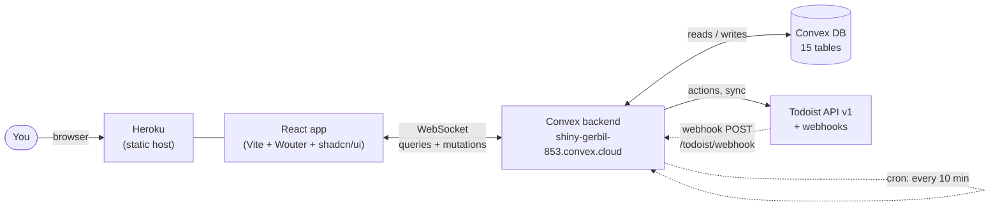
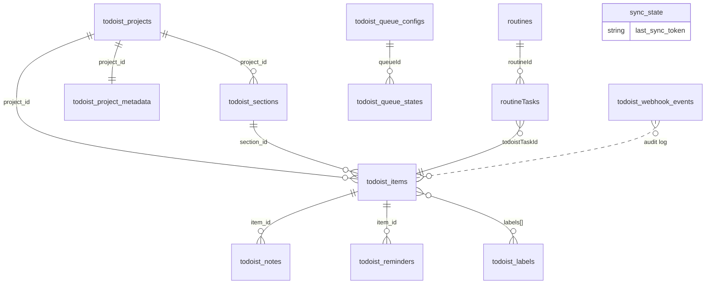
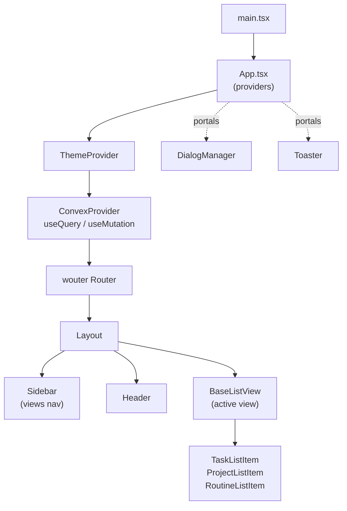

# Architecture

A one-page tour of how this repo is built. For deeper dives see `docs/architecture.md` (principles + service patterns) and `docs/view-architecture-diagrams.md` (the frontend view system).

## What this is

A personal database that mirrors Todoist into Convex, then layers a `routines` system (recurring habits → auto-generated Todoist tasks) on top, and exposes everything through a React app. External services remain the source of truth; this DB is the unified queryable surface.

## System diagram



- **Frontend:** Vite-built React app, deployed as static via Heroku (Docker build → `serve`).
- **Backend:** Convex hosted runtime — functions + DB + cron + HTTP routes in one platform.
- **External:** Todoist Sync API v1 only; v2/v9 are explicitly forbidden.

## Three-layer sync

```mermaid
flowchart TB
    subgraph "Layer 1: Action (user-driven)"
        A1[User clicks Sync] --> A2[runInitialSync /<br/>performIncrementalSync]
        A2 --> A3[Whitelist payload]
        A3 --> A4[upsertX internalMutation]
    end

    subgraph "Layer 2: Webhook (real-time)"
        W1[Todoist event] --> W2[POST /todoist/webhook]
        W2 --> W3[Verify HMAC-SHA256]
        W3 --> W4[Dedup by delivery_id]
        W4 --> A4
    end

    subgraph "Layer 3: Cron (catch-up)"
        C1[10-min interval] --> A2
    end

    A4 --> DB[(Convex DB)]
    A4 -. version check<br/>existing.sync_version &lt; new .-> A4
```

**Idempotency:** every upsert mutation reads the existing row's `sync_version` and skips if newer data already landed. The sync token is written **after** the batch — so on crash mid-loop, the next sync replays from the old token; version checks dedupe.

**Webhook routes:** `convex/http.ts` → `convex/todoist/webhook.ts` (HMAC verify, dedup, dispatch).

> Note: `crons.ts` currently has the daily-routine cron commented out pending a cloud-validation fix. Incremental sync runs every 10 minutes.

## Backend layout

```
convex/
├── _generated/         ← auto-generated by `bunx convex codegen` (gitignored)
├── schema.ts           ← defineSchema, spreads all table defs
├── schema/             ← per-service table definitions
│   ├── todoist/        ← 10 tables (items, projects, sections, …)
│   ├── routines/       ← 2 tables (routines, routineTasks)
│   └── sync/           ← sync_state
├── http.ts             ← HTTP router (Todoist webhook)
├── crons.ts            ← scheduled jobs
├── todoist/            ← the Todoist service (largest)
│   ├── actions/        ← public actions (user-triggered Todoist API calls)
│   ├── internalActions/
│   ├── mutations/      ← public mutations (UI-triggered DB writes)
│   ├── internalMutations/  ← internal DB writes (called from actions/webhooks)
│   ├── queries/        ← public queries (UI reads)
│   ├── internalQueries/    ← internal reads (called from actions)
│   ├── sync/           ← runInitialSync, performIncrementalSync
│   ├── computed/       ← derived/cached fields
│   ├── helpers/        ← non-Convex pure functions
│   ├── types/          ← syncApi.ts validators + TS types
│   └── webhook.ts      ← webhook handler
├── routines/           ← the Routines service (same shape)
│   ├── actions/ internalActions/ internalMutations/
│   ├── queries/ internalQueries/
│   ├── types/ utils/
│   └── crons.ts        ← daily generation cron entry
└── dashboard/queries/  ← cross-service stats
```

**`public` vs `internal` matters.**
- `mutation`/`query`/`action` → callable from the frontend via `api.x.y`.
- `internalMutation`/`internalQuery`/`internalAction` → only callable from other Convex functions via `internal.x.y`.

Folder name doesn't enforce this — the *constructor* you pass does. (We just spent a session fixing 15 files where this was wrong.)

## Data model



**15 tables, three domains:**

| Domain | Tables | Purpose |
|---|---|---|
| `todoist_*` | items, projects, sections, labels, notes, reminders, collaborators, project_metadata, queue_configs, queue_states, multi_lists, webhook_events | Mirror of Todoist + UI state (queues, lists) |
| `routines, routineTasks` | 2 | Recurring habit tracking with auto-generated Todoist tasks |
| `sync_state` | 1 | Last Todoist sync_token |

**Heavy validators** live in `todoist_queue_configs` (filter unions with 7+ variants). These are what required the static-codegen escape hatch.

## How routines work

The most interesting moving part. Routines exist **only in Convex** — Todoist has no concept of them. A routine is a recurring-habit template; the system materializes it into individual Todoist tasks on a schedule, then watches the Todoist webhook stream to reconcile what happened to those tasks.

```mermaid
sequenceDiagram
    autonumber
    actor User
    participant App as React app
    participant Routines as routines table
    participant RT as routineTasks table
    participant TItems as todoist_items table
    participant Todoist

    User->>App: define "Meditate", Daily, Morning, 5min
    App->>Routines: insert routine
    Note over Routines: lives only in Convex

    rect rgb(245,248,255)
        Note over Routines,Todoist: GENERATION (daily cron, currently manual via SyncDialog)
        Routines->>RT: generateTasksForRoutine<br/>insert with todoistTaskId="PENDING"
        RT->>Todoist: createRoutineTaskInTodoist<br/>addTask({ labels: ["routine","Morning"], ... })
        Todoist-->>RT: real task id
        RT->>RT: linkRoutineTask (writes real id)
        Todoist-->>TItems: upsertItem (so it shows in views)
    end

    rect rgb(248,255,245)
        Note over User,RT: USER COMPLETES IN TODOIST
        User->>Todoist: check off the task
        Todoist-->>App: webhook: item:completed
        App->>RT: markRoutineTaskCompleted<br/>recalculate completion rate
    end

    rect rgb(255,248,245)
        Note over RT,Todoist: DAILY MAINTENANCE (same cron)
        RT->>RT: pending &gt;2 days → status="missed"
        RT->>Todoist: closeTask (auto-complete in Todoist)
        RT->>Routines: recompute completionRateOverall + completionRateMonth
    end
```

### Key design choices

- **The `"routine"` label is the lingua franca.** Every generated task carries it. The webhook handler (`webhook.ts:handleRoutineTaskEvent`) uses it to know whether `item:completed` is "just a task" or "a routine instance whose stats need updating." Filter `@routine` in Todoist to see the entire auto-generated set.
- **The `"PENDING"` placeholder pattern.** A `routineTasks` row is inserted *before* the Todoist API call, with `todoistTaskId: "PENDING"`. This means a crash mid-creation leaves a recoverable record rather than a ghost. Once Todoist returns, `linkRoutineTask` writes the real ID back. The `clearAllPendingRoutineTasks` action knows to delete these PENDING rows separately from real-linked ones.
- **Daily / idealDay → `dueDate`. Everything else → `deadlineDate`.** Daily routines (and ones pinned to a specific day) should show up in Today. Looser frequencies (Monthly, Quarterly) use a deadline so they sit in the background until you choose to do them.
- **Auto-missing is two-sided.** When the maintenance pass marks a routine task `missed` (>2 days pending), it also calls `client.closeTask` in Todoist. Otherwise you'd accumulate stale tasks that you *did* miss but Todoist still considers open. From inside Todoist, tasks you didn't touch can disappear — that's the system finalizing the miss.
- **Status union is closed:** `pending | completed | missed | skipped | deferred`. Webhook events map cleanly: `item:completed → completed`, `item:deleted → skipped`, `item:uncompleted → pending`. The `missed` and `deferred` states are only reachable from inside the system.
- **Completion rate stays `null` until there's data.** `completionRateOverall = null` means "not enough completions+misses to compute a rate yet" — the UI should treat it as "unknown," not "0%."
- **`defer: boolean` is a soft pause.** Generation skips deferred routines; existing pending tasks get marked `deferred`. Useful for "I'm on vacation, don't bug me about meditating." Un-defer (`undeferRoutine`) and the next generation pass picks back up.

### The vibe

The whole layer is built on a single bet: **Todoist is the source of truth, and the routine system never owns task state — only the *template* and the *history*.** That's why:

- There's no "complete routine" button anywhere. You complete the task in Todoist; we observe it.
- `routineTasks` is a *log*, not authority. If `todoist_items` says "this task is open" and `routineTasks` says "completed," the webhook will fix `routineTasks`, not the other way around.
- Adding a new frequency = adding a date-math function in `utils/dateCalculation.ts` + a union member. Everything downstream just works because it routes through the same generate → create → link → observe pipeline.

This makes the system resilient: if you delete a routine task in Todoist, it just becomes `skipped`; if you uncheck a completed one, it goes back to `pending`; if you complete one a year late, it counts as a completion (which dilutes your "missed" rate but doesn't break anything).

## Frontend stack



**Stack choices:**
- **Vite** dev + build; **wouter** for routing (~1.5 KB, no router config); **Convex React** for live data.
- **shadcn/ui + Radix + Tailwind + lucide-react** — copy-in components, not a package dep.
- **dnd-kit** for drag-and-drop, **date-fns** for time math, **next-themes** for dark mode, **sonner** for toasts, **cmdk** for command palette.
- **next-themes + class-based dark mode** + `data-*` attributes for keyboard nav hooks on sidebar items.

**View system:** `app/src/lib/views/` declares each view (Inbox, Today, Upcoming, project pages, routines, etc.) as a config object. The sidebar and routing both consume the same registry. See `docs/view-architecture-diagrams.md`.

**Convex client types:** generated under `app/src/convex/_generated/` (separate from the backend's `convex/_generated/`). Both refresh from `bunx convex codegen`.

## Deployment

| Component | Where | Trigger |
|---|---|---|
| Convex functions + DB | `shiny-gerbil-853.convex.cloud` | `bunx convex deploy` |
| Frontend (static) | Heroku via `heroku.yml` + `Dockerfile` | Heroku push |
| Local dev — backend | `bunx convex dev` (watch) | manual |
| Local dev — frontend | `bun --cwd app dev` (Vite on :3000) | manual |

**Env vars (Convex):**
- `TODOIST_API_TOKEN` — for outbound sync + actions
- `TODOIST_WEBHOOK_SECRET` — for HMAC verification on `/todoist/webhook`

**Env vars (frontend, baked at build):**
- `VITE_CONVEX_URL` — Convex deployment URL

## Static codegen

`convex.json` enables `codegen.staticApi` and `codegen.staticDataModel`. This materializes the `api` and `DataModel` types into concrete code instead of letting TS infer them through deep generics. The schema is big enough that without this, every mutation/query file hit `TS2589 — Type instantiation is excessively deep`.

**Tradeoffs to remember:**
- Types only refresh when `convex dev` is running (or after a manual `bunx convex codegen`).
- Jump-to-definition on `api.x.y` no longer works.
- Functions without a `returns:` validator are typed as `any` end-to-end. If you do a `ctx.runQuery` and the result type matters, either add a `returns:` to the called function or annotate the receiving variable explicitly.

## File conventions (cheat sheet)

- **One function per file**, with a parallel `feature.test.ts` for business logic.
- **Filename = export name** (`createTask.ts` exports `createTask`).
- **Folder name = visibility intent**, but it doesn't enforce — use the right constructor:
  - `internalMutations/foo.ts` → `internalMutation({ … })`
  - `mutations/foo.ts` → `mutation({ … })`
- **Sync payloads:** always whitelist fields from external API responses before passing to mutations. Otherwise the next time Todoist adds a field, sync breaks (this is how `reminders.is_urgent` happened).
- **Validators live in `<service>/types/`**, not inline.
- **Strict TS, no `any`.** When forced (e.g. dynamic `Object.entries` building), narrowly scope the `any` and disable the lint rule on that line.

## Quick orientation by file

| Want to … | Look in … |
|---|---|
| Add a new Todoist API call | `convex/todoist/actions/` |
| Add a new table | `convex/schema/<domain>/X.ts` then re-spread in the domain index |
| Add a new sidebar view | `app/src/lib/views/` (follow `docs/adding-views-guide.md`) |
| Add a keyboard shortcut | `app/src/lib/shortcuts/registry.ts` + handler in `Layout.tsx` |
| Read the webhook flow | `convex/http.ts` → `convex/todoist/webhook.ts` |
| Read the sync flow | `convex/todoist/sync/runInitialSync.ts`, `performIncrementalSync.ts` |
| Read the daily routine cron | `convex/routines/crons.ts` → `internalActions/generateDailyRoutineTasks.ts` |

## When in doubt

`CLAUDE.md` at the repo root is the agent-facing rules-of-the-road. `AGENTS.md` mirrors it for non-Claude tools.
