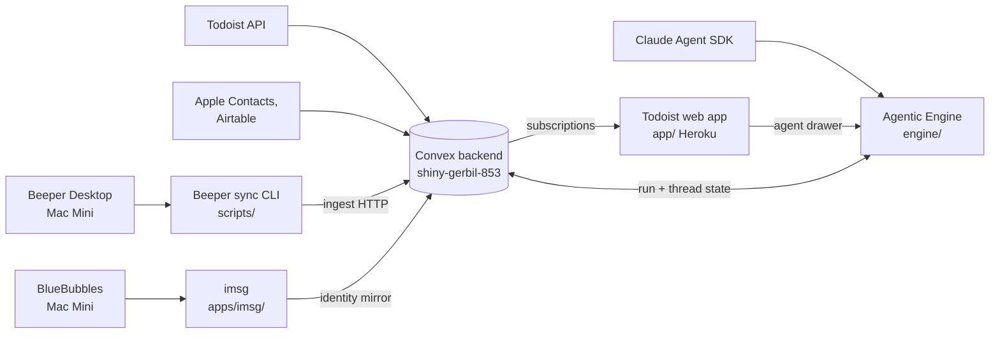

# master-db

Milad's personal data hub. A Convex backend mirrors external services into one queryable
store, and several clients sit on top of it: a Todoist web app, a self-hosted iMessage
client, an agentic decision engine, and a Beeper archive pipeline. It began as a Todoist
mirror in September 2025 and has since absorbed a routines engine, an identity graph, a
message archive, and the agentic run state. Single user, single operator, no external
consumers.

## Components

Five, in five directories. They share a repository and a Convex deployment.

| Component | Path | What it is |
|---|---|---|
| Convex backend | `convex/` | Schema, functions, crons, HTTP routes. The center of gravity and the only cloud-deployed thing. Six domains: `todoist`, `routines`, `identity`, `beeper`, `agentic`, `dashboard`. |
| Todoist web app | `app/` | Vite and React 19 SPA with an agent drawer. Deployed to Heroku via Docker. |
| imsg | `apps/imsg/` | Bun and Hono server fronting a BlueBubbles instance, plus an Expo RNW client. A self-hosted iMessage client. Runs on the Mac Mini. Its own `bun.lock`, lint config, and CONTEXT. |
| Agentic Engine | `engine/` | Bun and Hono HTTP service wrapping the Claude Agent SDK for async, durable, multi-entity runs. Runs on the Mac Mini. |
| Beeper sync CLI | `scripts/` | An operator-run Bun CLI pair that pulls Beeper chats and attachments and POSTs them to a Convex ingest endpoint. Not deployed; run by hand from a trusted machine. |

`test-utils/` is a shared test-support library, not a component. `docs/` is documentation.
An older inventory recorded four components and omitted the Beeper CLI, which has its own
commands, configuration, dry-run path, and per-machine state file.

## How they relate

Convex is the only shared store, and every client reaches every other client through it.
The Beeper CLI and imsg write into Convex; the engine keeps its run and thread state
there; the Todoist web app reads Convex and calls the engine for its agent drawer. imsg
and the engine run on the Mac Mini under launchd, the web app deploys to Heroku, and the
Beeper CLI runs by hand.

## What the components share

**One repository, three local names, and it has already caused a triple-count.** The real
checkout is `Repos/convex-db`. `Repos/master-db` is a symlink to it, and `Repos/imsg` is a
symlink to its `apps/imsg` subdirectory. The GitHub remote is `mimen/master-db`. Tracked
files also point at a stale `~/Documents/GitHub/master-db` and at the Mac Mini's own
checkout path. These are all the same repository and the same inode. An estate census
counted `convex-db`, `master-db`, and `imsg` as three repositories and, because each
carries the same ~51 linked worktrees under `.claude/worktrees/`, inflated a fleet-wide
worktree total by 102. The next census will make the same mistake unless it dedupes on
`repo_key`.

**One Convex deployment serves everything.** There is no separate development environment
in the tracked config. `convex/_generated/` is gitignored and absent from a fresh clone,
so nothing in `convex/` typechecks or runs until `bunx convex dev --once` regenerates it
against an authenticated deployment. `app/src/convex/_generated/` is committed, so the
frontend's copy of the generated API can drift silently from the backend's.

**Credentials resolve at runtime, never from a tracked file.** Backend secrets are set with
`bunx convex env set`, the engine reads its secrets through `op read`, and the Beeper CLI
sources a 1Password item. No `.env` is tracked, so a local run of any component needs its
variables supplied first. Bun is the runtime throughout.

## Operating notes that span components

**The local checkout is routinely behind `origin/main`, and the Mac Mini deploys from
`origin/main`.** At the last audit the inspected checkout was 110 commits behind (three
weeks of work). Because `apps/imsg/scripts/deploy.sh` pulls `origin/main` on the Mini, the
imsg that runs there is whatever `origin/main` is, not whatever a local tree happens to be.
Re-check anything actionable against the remote tip before acting on a local checkout.

**Two Convex deployment names appear in tracked files and it is unresolved.** Eight
references name `shiny-gerbil-853`; two name `blessed-egret-906`, one of which is an
operator command in `convex/beeper/README.md` aiming an attachment backfill. If that is a
second deployment, the repo runs two and documents neither as such; if it is a stale
copy-paste, the backfill command points at the wrong deployment. Tracked as issue #58; do
not resolve it by guessing.

## Repo-level gaps

No CI beyond `.github/workflows/deploy-imsg.yml`, which only deploys and is path-scoped to
`apps/imsg/**`, so changes to the other four components trigger nothing. The root
`README.md` still describes a Todoist-only project, calls the frontend "Next.js (planned)"
when it is Vite and React 19, links three docs that do not exist, and tells a fresh clone to
copy a `.env.example` that is not there. No root `DEPLOY.md` points at the good
per-component runbooks (`engine/runbook.md`, `apps/imsg`), so the deployment registry has no
root to read from. Five third-party seams (Todoist, BlueBubbles, Beeper, Airtable, the
Claude Agent SDK) are covered by hand-authored mocks with zero recorded provider responses,
so a provider changing shape surfaces as a broken run rather than a failing test.
