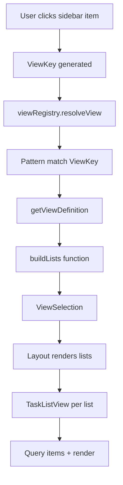
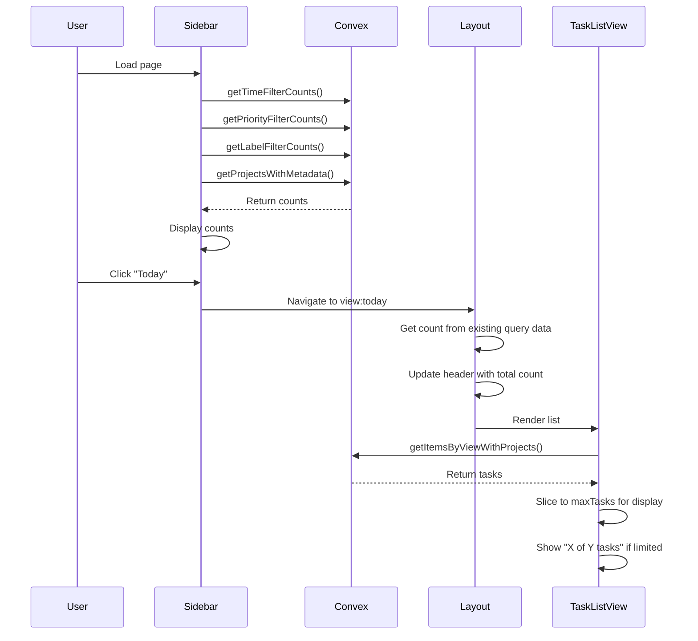
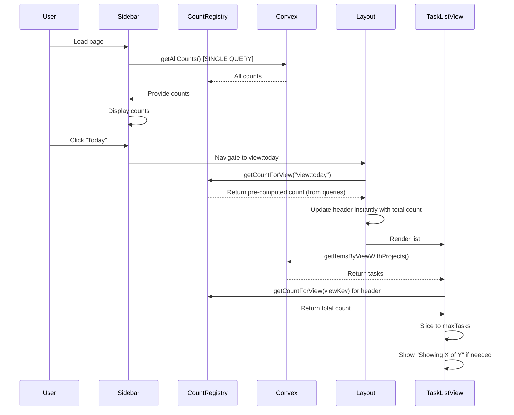

# View Architecture Analysis & Improvement Proposal

**Date**: 2025-11-10
**Author**: Architecture Review
**Status**: Analysis & Recommendations

---

## Executive Summary

This document analyzes the current task management application's view architecture, identifies scalability concerns, and proposes improvements for extensibility as the platform grows.

### Key Issues to Solve

1. ✅ ~~Inconsistent task counts~~ - Fixed in another branch
2. **Multiple count computation locations** - No single source of truth
3. **Multi-list views missing counts** in sidebar (e.g., Priority Queue has no count badge)
4. **Performance impact** - 4 separate queries (~380ms) could be 1 query (~250ms, 34% faster)

### Proposed Solution: Simplified Count System

**Core Principle**: List counts are the fundamental unit. Views aggregate their lists.

**Architecture**:
```
List Counts (from DB queries)
  ↓
Views = Lists + Icon + Metadata
  ↓
View Count = Sum of all list counts in that view
```

**Examples**:
- **Inbox view** = 1 list → count = inbox list count
- **Priority Queue view** = 7 lists → count = sum of 7 list counts
- **Project Family view** = N lists → count = sum of N list counts

**Key Benefits**:
- ✅ Single unified model (no strategy branching needed)
- ✅ Counts available instantly (no waiting for render)
- ✅ Sidebar and header always consistent
- ✅ Multi-list counts work automatically
- ✅ Better UX: "Showing 10 of 50 tasks" is more informative

**Implementation**: Count Registry stores list counts, computes view counts by summation (~250ms vs ~380ms, **34% faster**)

---

## 1. Current Architecture Overview

### 1.1 Terminology & Concepts

The application currently uses a **two-tier hierarchy**:

```
View (ViewSelection)
├── metadata: { title, icon, description }
└── lists: ListInstance[]
    ├── id: "view:inbox:main"
    ├── viewKey: "view:inbox"
    ├── query: ListQueryInput
    ├── getHeader: (context) => { title, description, icon, count }
    └── getEmptyState: (context) => { ... }
```

**Terminology**:
- **View**: A user-facing navigation target that resolves to one or more lists
  - Examples: "Inbox", "Today", "Priority Queue", "Project: Work"
  - Identified by: `ViewKey` pattern (e.g., `"view:inbox"`, `"view:today"`)
  - Appears in: Sidebar navigation, Command-K, Top header

- **List**: A concrete query + rendering template for displaying tasks
  - Examples: Single project list, time-filtered list, priority-filtered list
  - Identified by: `ListInstance.id` (e.g., `"view:inbox:main"`)
  - Appears in: Main content area as task list

- **Multi-List**: A special view type that composes multiple lists into a single view
  - Examples: "Priority Queue" (7 lists), "Morning Review" (3 lists)
  - Each component list can have `maxTasks` limit
  - Appears as: Collapsible sections in main content area

**Current Relationship**:
- Most views expand to **1 list** (e.g., "Inbox" → inbox list)
- Some views expand to **multiple lists** (e.g., "Project Family" → parent + children lists)
- Multi-list views expand to **N lists** from different views (e.g., "Priority Queue" → overdue + today + inbox + p1 + ...)

### 1.2 View Resolution Flow



**Files involved**:
- `app/src/lib/views/viewRegistry.tsx` - Pattern matcher
- `app/src/lib/views/viewDefinitions.tsx` - 23 view patterns
- `app/src/lib/views/listDefinitions.tsx` - 5 list types
- `app/src/components/layout/Layout.tsx` - View orchestrator
- `app/src/components/TaskListView.tsx` - List renderer

### 1.3 Current View Patterns (23 types)

| Pattern | Example | Expands To |
|---------|---------|------------|
| `view:inbox` | Inbox | 1 list |
| `view:today` | Today | 1 list |
| `view:upcoming` | Next 7 days | 1 list |
| `view:time:${range}` | Overdue, No Date | 1 list |
| `view:project:${id}` | Single project | 1 list |
| `view:project-family:${id}` | Project + children | N lists (1 + children) |
| `view:priority:${level}` | P1, P2, P3, P4 | 1 list |
| `view:priority-projects:${level}` | Projects at priority | 1 list per project |
| `view:label:${name}` | Label filter | 1 list |
| `view:multi:${id}` | Priority Queue | N lists (composition) |

---

## 2. Task Count Architecture

### 2.1 Current Count Computation Locations

**Location 1: Query-Time (Convex Backend)**

Count queries run on every page load/navigation:

| Query | Purpose | Computed For |
|-------|---------|--------------|
| `getTimeFilterCounts.ts` | Time-based counts | Overdue, Today, Tomorrow, Next 7 Days, Future, No Date |
| `getPriorityFilterCounts.ts` | Priority-based counts | P1, P2, P3, P4 |
| `getLabelFilterCounts.ts` | Label-based counts | All active labels |
| `getProjectsWithMetadata.ts` | Project stats | Each project: `stats.activeCount` |

**Used by**: Sidebar sections (TimeSection, ProjectsSection, PrioritiesSection, LabelsSection)

**Location 2: Aggregation (Client-Side)**

Multi-list and composed views compute counts by summing component view counts:

```typescript
// Priority Queue count = sum of component view counts
const priorityQueueCount =
  timeFilterCounts.overdue +
  timeFilterCounts.today +
  inboxCount +
  priorityFilterCounts.p1 +
  // ... other components
```

**Used by**: Sidebar (for multi-list views), Top header (for aggregate totals)

### 2.2 Problems with Current Count System

#### Problem 1: Inconsistent Count Display

**Example**: "Today" view in Time section shows no count, but has 1 task

**Root Cause**:
- Sidebar query might return stale or missing data
- Count queries don't always align with what's displayed
- No single source of truth for counts

**Code Location**:
- Sidebar count: `app/src/components/layout/Sidebar/sections/TimeSection.tsx:32`
  ```typescript
  count={timeFilterCounts?.today ?? 0}
  ```

#### Problem 2: Priority Queue Missing Count

**Example**: Priority Queue shows no count badge in sidebar

**Root Cause**:
- Priority Queue is a multi-list view (`view:multi:priority-queue`)
- Sidebar only shows counts from direct query results
- Multi-list counts require rendering all component lists first
- No pre-computed aggregate available

**Code Location**:
- `app/src/components/layout/Sidebar/sections/ViewsSection.tsx:16`
  ```typescript
  buildViewItems(inboxCount) // Only inbox has count
  ```

#### Problem 3: Multiple Separate Queries

Count data is fetched via **4 separate Convex queries**:

1. `getTimeFilterCounts` (~50ms)
2. `getPriorityFilterCounts` (~30ms)
3. `getLabelFilterCounts` (~100ms)
4. `getProjectsWithMetadata` (~200ms)

**Total: ~380ms** on every page load

**Impact**:
- Slower initial page load
- Multiple round trips to backend
- Counts could be combined into single query (~250ms, **34% faster**)

#### Problem 4: No Single Source of Truth

Counts exist in multiple places with no centralized management:
- Convex queries return raw counts
- Sidebar sections independently access different count queries
- Multi-list views have no pre-computed counts
- No centralized registry to ensure consistency

**Impact**: Hard to debug count discrepancies, no guarantee of consistency across UI

---

## 3. Rendering Locations & Responsibilities

### 3.1 Sidebar Navigation

**File**: `app/src/components/layout/Sidebar/Sidebar.tsx`

**Sections**:
| Section | Displays | Count Source | File |
|---------|----------|--------------|------|
| ViewsSection | Inbox, Priority Queue, Settings | `inboxProject.stats.activeCount` | `sections/ViewsSection.tsx` |
| TimeSection | Overdue, Today, Tomorrow, etc. | `timeFilterCounts` query | `sections/TimeSection.tsx` |
| ProjectsSection | All projects, grouped/sorted | `project.stats.activeCount` per project | `sections/ProjectsSection.tsx` |
| PrioritiesSection | P1, P2, P3, P4 | `priorityFilterCounts` query | `sections/PrioritiesSection.tsx` |
| LabelsSection | Top 50 labels, sorted | `labelFilterCounts` query | `sections/LabelsSection.tsx` |

**Count Badge**: `components/CountBadge.tsx` (only shows if count > 0)

### 3.2 Top Header / Navigation Bar

**File**: `app/src/components/layout/Layout.tsx:91-104`

**Displays**:
- View icon (from `activeView.metadata.icon`)
- View title (from `activeView.metadata.title`)
- **Total task count badge** (aggregated from all lists)

**Count Source**: `useTaskCounts()` hook aggregation

### 3.3 List Headers (Main Content)

**File**: `app/src/components/TaskListView.tsx:138-153`

**Each list header shows**:
- Icon (project color, calendar, priority flag)
- Title (project name, "Inbox", "Today", etc.)
- Description with total count and visible indicator
  - If maxTasks limit: `"Showing 10 of 50 tasks"`
  - Otherwise: `"50 tasks"`
- Collapsible controls (multi-list only)

**Count Source**: Count Registry (total count from queries)

### 3.4 Multi-List Compact View

**File**: `app/src/components/TaskListView.tsx:155-170`

When dismissed or empty, shows compact header with total count badge:
```typescript
<Badge variant="secondary">
  {totalCount > 0 ? totalCount : "Empty"}
</Badge>
```

---

## 4. Conceptual Model Clarification

### 4.1 Proposed Unified Model

**Terminology Recommendation**:

```
┌─────────────────────────────────────────────────────────┐
│                    VIEW (User Concept)                   │
│  What users see in sidebar and navigate to             │
│  Examples: Inbox, Today, Priority Queue, Project        │
└──────────────────────┬──────────────────────────────────┘
                       │
                       │ resolves to
                       ▼
┌─────────────────────────────────────────────────────────┐
│              VIEW SELECTION (Resolved View)              │
│  ViewKey + Metadata + Lists[]                           │
│  The expanded view with all necessary rendering info    │
└──────────────────────┬──────────────────────────────────┘
                       │
                       │ contains
                       ▼
┌─────────────────────────────────────────────────────────┐
│                  LIST INSTANCE                           │
│  A concrete query + rendering template                  │
│  One visual section in the main content area            │
└──────────────────────┬──────────────────────────────────┘
                       │
                       │ renders
                       ▼
┌─────────────────────────────────────────────────────────┐
│                   TASK ROWS                              │
│  Individual task items in a list                        │
└─────────────────────────────────────────────────────────┘
```

**Key Principle**:
- **List Counts** = Fundamental unit (from DB queries)
- **Views** = Containers of lists with icon/metadata
- **View Count** = Sum of all list counts in that view
- **Sidebar & Header** = All views show here (single-list and multi-list)
- **List Headers** = Individual lists show total count ("Showing X of Y")
- **maxTasks** = Rendering limit only, doesn't affect count display

**Simple Architecture**:
```
DB Queries → List Counts (fundamental unit)
                ↓
           Views = Lists + Icon + Metadata
                ↓
           View Count = Sum of list counts
                ↓
        Display in: Sidebar, Top Header, List Headers
```

### 4.2 View vs List vs Multi-List

**Current Reality**:
- Views and lists are tightly coupled
- Multi-lists are views that compose other views' lists
- No clear separation of concerns

**Recommended Separation**:

| Concept | Responsibility | Where Defined | Where Rendered |
|---------|----------------|---------------|----------------|
| **View** | Navigation target, user-facing name/icon | `viewDefinitions.tsx` | Sidebar, Command-K, Top header |
| **List** | Query definition, rendering template | `listDefinitions.tsx` | Main content area |
| **List Instance** | Concrete list with params | Runtime (view resolution) | TaskListView component |
| **Multi-List** | Composition of multiple views | `defaults.tsx` | Multiple TaskListView components |

---

## 5. Proposed Improvements

### 5.1 Unified Count System

**Goal**: Single source of truth for all counts, computed once, used everywhere

**Proposal**: **Count Registry** pattern

```typescript
// New file: app/src/lib/views/countRegistry.ts

interface CountRegistry {
  // List counts (fundamental unit from DB queries)
  listCounts: {
    'list:inbox': number
    'list:time:today': number
    'list:time:overdue': number
    'list:time:upcoming': number
    'list:time:no-date': number
    'list:project:${projectId}': number
    'list:priority:p1': number
    'list:priority:p2': number
    'list:priority:p3': number
    'list:priority:p4': number
    'list:label:${labelName}': number
    // ... etc
  }

  // Method: Compute view count by summing its lists
  getCountForView(viewKey: ViewKey): number {
    const view = resolveView(viewKey)
    return view.lists.reduce((sum, list) => {
      return sum + (this.listCounts[list.id] ?? 0)
    }, 0)
  }
}
```

**Implementation**:

1. **Single query endpoint** that returns all list counts:
   ```typescript
   // convex/todoist/queries/getAllListCounts.ts
   export const getAllListCounts = query({
     handler: async (ctx) => {
       const timeFilterCounts = await getTimeFilterCounts(ctx)
       const priorityFilterCounts = await getPriorityFilterCounts(ctx)
       const labelFilterCounts = await getLabelFilterCounts(ctx)
       const projectCounts = await getProjectCounts(ctx)
       const inboxCount = await getInboxCount(ctx)

       // Return as flat map of list IDs to counts
       return {
         'list:inbox': inboxCount,
         'list:time:today': timeFilterCounts.today,
         'list:time:overdue': timeFilterCounts.overdue,
         'list:time:upcoming': timeFilterCounts.upcoming,
         'list:time:no-date': timeFilterCounts.noDate,
         'list:priority:p1': priorityFilterCounts.p1,
         'list:priority:p2': priorityFilterCounts.p2,
         'list:priority:p3': priorityFilterCounts.p3,
         'list:priority:p4': priorityFilterCounts.p4,
         ...Object.fromEntries(
           Object.entries(projectCounts).map(([id, count]) =>
             [`list:project:${id}`, count]
           )
         ),
         ...Object.fromEntries(
           Object.entries(labelFilterCounts).map(([name, count]) =>
             [`list:label:${name}`, count]
           )
         )
       }
     }
   })
   ```

2. **Count context provider**:
   ```typescript
   // app/src/contexts/CountContext.tsx
   const CountContext = createContext<CountRegistry>()

   export function CountProvider({ children }) {
     const listCounts = useQuery(api.todoist.queries.getAllListCounts)
     const registry = useMemo(() => new CountRegistry(listCounts), [listCounts])
     return <CountContext.Provider value={registry}>{children}</CountContext.Provider>
   }
   ```

3. **All views use the same pattern** (sidebar, header, lists):
   ```typescript
   // Any component - sidebar, header, list
   const { getCountForView } = useCountRegistry()

   // Single-list view (Inbox)
   const inboxCount = getCountForView("view:inbox")  // = listCounts['list:inbox']

   // Multi-list view (Priority Queue)
   const priorityQueueCount = getCountForView("view:multi:priority-queue")
   // = sum of 7 list counts

   // Project view
   const projectCount = getCountForView("view:project:abc123")
   // = listCounts['list:project:abc123']
   ```

4. **List headers show total counts**:
   ```typescript
   // TaskListView.tsx
   const totalCount = registry.getCountForView(list.viewKey)
   const visibleCount = items.slice(0, maxTasks).length

   <ListHeader
     description={
       visibleCount < totalCount
         ? `Showing ${visibleCount} of ${totalCount} tasks`
         : `${totalCount} tasks`
     }
   />
   ```

**Benefits**:
- ✅ Single query for all counts (reduce backend calls)
- ✅ Consistent counts across all display locations
- ✅ Multi-list counts automatically computed
- ✅ Easy to debug count mismatches (one place to check)

### 5.2 View Metadata Enhancement

**Goal**: Attach all necessary metadata to views at definition time

**Current Problem**:
- View metadata is minimal (title, icon, description)
- Count calculation logic scattered
- No way to know if view supports counts

**Proposal**: Enhance `ViewDefinition` type

```typescript
// app/src/lib/views/types.ts

interface ViewDefinition {
  // Existing
  pattern: string | RegExp
  metadata: ViewMetadata
  buildLists: (viewKey: ViewKey, depth: number, context?: ViewBuildContext) => ListInstance[]

  // NEW: Count is always computed from lists (no strategy needed)
  // View count = sum of all list counts in the view

  // NEW: Display rules (optional - defaults to showing everywhere)
  displayRules?: {
    showInSidebar?: boolean      // Default: true
    showInCommandK?: boolean     // Default: true
    showCountBadge?: boolean     // Default: true
  }

  // Note: No need for composition metadata!
  // - Single vs multi? Check view.lists.length
  // - Collapsible? Already on ListInstance.collapsible
  // - maxLists? Just let buildLists() return what it needs
}
```

**Example Implementation**:

```typescript
// viewDefinitions.tsx

const todayViewDefinition: ViewDefinition = {
  pattern: /^view:today$/,
  metadata: {
    title: "Today",
    icon: <CalendarIcon />,
    description: "Tasks due today"
  },
  // Count automatically computed: sum of list counts (in this case, just 1)
  buildLists: (viewKey, depth, context) => [
    {
      id: 'list:time:today',
      viewKey,
      collapsible: false,  // Single-list views typically not collapsible
      // ... rest of list config
    }
  ]
}

const priorityQueueDefinition: ViewDefinition = {
  pattern: /^view:multi:priority-queue$/,
  metadata: {
    title: "Priority Queue",
    icon: <FlameIcon />,
    description: "Your most important tasks"
  },
  // Count automatically computed: sum of all 7 list counts
  buildLists: (viewKey, depth, context) => [
    { id: 'list:time:overdue', collapsible: true, /* ... */ },
    { id: 'list:time:today', collapsible: true, /* ... */ },
    { id: 'list:inbox', collapsible: true, maxTasks: 10, /* ... */ },
    { id: 'list:priority:p1', collapsible: true, /* ... */ },
    // ... 3 more lists, all collapsible
  ]
}

const settingsViewDefinition: ViewDefinition = {
  pattern: /^view:settings$/,
  metadata: {
    title: "Settings",
    icon: <SettingsIcon />,
    description: "Application settings"
  },
  displayRules: {
    showCountBadge: false  // Settings don't have a count
  },
  buildLists: () => []  // No task lists, just settings UI
}
```

**Benefits**:
- ✅ All view behavior defined in one place
- ✅ Count logic tied to view definition
- ✅ Easy to add new views with consistent patterns
- ✅ Clear documentation of view capabilities

### 5.3 View Registry Enhancement

**Goal**: Make view registry more powerful and extensible

**Current Problems**:
- Pattern matching is simple string/regex
- No way to register custom views at runtime
- Hard to extend with plugins/integrations

**Proposal**: Plugin-based view registry

```typescript
// New file: app/src/lib/views/viewRegistry2.ts

interface ViewPlugin {
  id: string
  name: string
  patterns: ViewPattern[]
  definitions: ViewDefinition[]

  // Lifecycle hooks
  onRegister?: (registry: ViewRegistry) => void
  onViewResolve?: (viewKey: ViewKey) => ViewSelection | null
  onViewRender?: (view: ViewSelection) => void
}

class ViewRegistry {
  private plugins = new Map<string, ViewPlugin>()
  private definitions = new Map<string, ViewDefinition>()

  registerPlugin(plugin: ViewPlugin) {
    this.plugins.set(plugin.id, plugin)
    plugin.definitions.forEach(def => this.registerDefinition(def))
    plugin.onRegister?.(this)
  }

  resolveView(viewKey: ViewKey, context?: ViewBuildContext): ViewSelection {
    // Try plugins first
    for (const plugin of this.plugins.values()) {
      const result = plugin.onViewResolve?.(viewKey)
      if (result) return result
    }

    // Fall back to pattern matching
    const definition = this.findDefinition(viewKey)
    return this.expandView(definition, viewKey, context)
  }
}

// Export singleton
export const viewRegistry = new ViewRegistry()
```

**Built-in Plugins**:

```typescript
// plugins/todoistViews.ts
const todoistViewsPlugin: ViewPlugin = {
  id: 'todoist-core',
  name: 'Todoist Core Views',
  patterns: [
    /^view:inbox$/,
    /^view:today$/,
    /^view:upcoming$/,
    /^view:project:(.+)$/,
    /^view:priority:(.+)$/,
    /^view:label:(.+)$/,
  ],
  definitions: [
    inboxViewDefinition,
    todayViewDefinition,
    projectViewDefinition,
    // ...
  ]
}

// plugins/multiListViews.ts
const multiListViewsPlugin: ViewPlugin = {
  id: 'multi-lists',
  name: 'Multi-List Views',
  patterns: [
    /^view:multi:(.+)$/
  ],
  definitions: [
    priorityQueueDefinition,
    morningReviewDefinition,
    weeklyPlanningDefinition
  ]
}

// Register plugins
viewRegistry.registerPlugin(todoistViewsPlugin)
viewRegistry.registerPlugin(multiListViewsPlugin)
```

**Benefits**:
- ✅ Easy to add new integrations (GitHub, Linear, etc.)
- ✅ Plugin isolation (no conflicts between integrations)
- ✅ Dynamic view registration (user-defined views)
- ✅ Clear extension points for future features

### 5.4 Count Computation (Unified Pattern)

**Goal**: Single unified pattern - no strategies needed

**How It Works**:

All view counts are computed the same way:
```typescript
viewCount = sum of all list counts in that view
```

**Examples**:

| View Type | Lists | Count Computation |
|-----------|-------|-------------------|
| Inbox | 1 list: `list:inbox` | = `listCounts['list:inbox']` |
| Today | 1 list: `list:time:today` | = `listCounts['list:time:today']` |
| Priority Queue | 7 lists | = sum of 7 list counts |
| Project Family | N lists (parent + children) | = sum of N list counts |
| Project (single) | 1 list: `list:project:${id}` | = `listCounts['list:project:${id}']` |

**Implementation**:

```typescript
// app/src/lib/views/CountRegistry.ts

class CountRegistry {
  constructor(private listCounts: Record<string, number>) {}

  getCountForView(viewKey: ViewKey): number {
    // Resolve view to get its lists
    const view = resolveView(viewKey)

    // Sum all list counts
    return view.lists.reduce((sum, list) => {
      return sum + (this.listCounts[list.id] ?? 0)
    }, 0)
  }
}
```

**Where Displayed**:
- **Sidebar**: All views (single-list and multi-list)
- **Top header**: Current active view
- **List headers**: Each individual list in the view

**Benefits**:
- ✅ No strategy branching - same logic for all views
- ✅ Easy to reason about
- ✅ Multi-list counts work automatically
- ✅ Consistent everywhere

---

## 6. Migration Plan

### Phase 1: Add Count Registry (Week 1)

**Tasks**:
1. Create `countRegistry.ts` with `CountRegistry` class
2. Create `getAllCounts` Convex query
3. Add `CountProvider` context
4. Implement `useCountRegistry` hook

**Testing**:
- Compare old counts vs new counts
- Verify performance (should be faster with single query)

### Phase 2: Migrate Sidebar (Week 2)

**Tasks**:
1. Update TimeSection to use count registry
2. Update ProjectsSection to use count registry
3. Update PrioritiesSection to use count registry
4. Update LabelsSection to use count registry
5. Update ViewsSection to compute Priority Queue count

**Testing**:
- Visual regression testing (counts should match)
- Add multi-list count tests

### Phase 3: Enhance View Definitions (Week 3)

**Tasks**:
1. Add `countStrategy` to ViewDefinition type
2. Add `displayRules` to ViewDefinition type
3. Add `composition` to ViewDefinition type
4. Update all view definitions with new fields

**Testing**:
- TypeScript type checking
- Count computation tests

### Phase 4: Implement Plugin System (Week 4)

**Tasks**:
1. Create ViewRegistry class
2. Create ViewPlugin interface
3. Split current definitions into plugins
4. Register plugins in app initialization

**Testing**:
- View resolution tests
- Plugin lifecycle tests

---

## 7. Testing Strategy

### Unit Tests

```typescript
// countRegistry.test.ts
describe('CountRegistry', () => {
  test('computes query-based counts correctly', () => {
    const registry = new CountRegistry(mockQueryData)
    expect(registry.getCountForView('view:today')).toBe(5)
  })

  test('aggregates multi-list counts correctly', () => {
    const registry = new CountRegistry(mockQueryData)
    registry.updateListCount('list-1', 3)
    registry.updateListCount('list-2', 7)
    expect(registry.computeViewCount('view:multi:priority-queue')).toBe(10)
  })
})

// viewRegistry.test.ts
describe('ViewRegistry', () => {
  test('resolves simple views', () => {
    const view = viewRegistry.resolveView('view:inbox')
    expect(view.lists).toHaveLength(1)
  })

  test('resolves multi-list views', () => {
    const view = viewRegistry.resolveView('view:multi:priority-queue')
    expect(view.lists.length).toBeGreaterThan(1)
  })

  test('computes correct counts for resolved views', () => {
    const view = viewRegistry.resolveView('view:today')
    const count = countRegistry.getCountForView(view.key)
    expect(count).toBeGreaterThanOrEqual(0)
  })
})
```

### Integration Tests

```typescript
// sidebar.integration.test.ts
describe('Sidebar Count Display', () => {
  test('displays consistent counts across sections', async () => {
    render(<Sidebar />)

    const todayInTime = screen.getByText('Today').closest('button')
    const todayCount = todayInTime.querySelector('[data-count]')

    // Click to navigate
    fireEvent.click(todayInTime)

    // Check top header count
    const headerCount = screen.getByTestId('header-count')

    expect(todayCount.textContent).toBe(headerCount.textContent)
  })
})
```

### Visual Testing

Use Chrome DevTools MCP to verify:
- Count badges appear correctly
- Multi-list counts display
- No count discrepancies

---

## 8. Performance Considerations

### Current Performance Issues

1. **Multiple Convex queries** on sidebar load:
   - `getTimeFilterCounts` (~50ms)
   - `getPriorityFilterCounts` (~30ms)
   - `getLabelFilterCounts` (~100ms)
   - `getProjectsWithMetadata` (~200ms)
   - **Total: ~380ms**

2. **Re-rendering on count updates**:
   - Each TaskListView triggers count update
   - Layout re-renders on every count change
   - Sidebar might re-render unnecessarily

### Proposed Optimizations

1. **Single count query**:
   ```typescript
   getAllCounts() // ~250ms (combined, with shared queries)
   ```
   **Savings: ~130ms (34% faster)**

2. **Memoized count registry**:
   ```typescript
   const registry = useMemo(() => new CountRegistry(allCounts), [allCounts])
   ```

3. **Batched count updates**:
   ```typescript
   // Instead of updating on each list render
   useEffect(() => {
     batchCountUpdates(() => {
       lists.forEach(list => updateCount(list.id, list.count))
     })
   }, [lists])
   ```

4. **Selective re-rendering**:
   ```typescript
   // Only re-render if specific count changes
   const todayCount = useCountForView('view:today')
   // Component only re-renders when todayCount changes
   ```

---

## 9. Extensibility for Future Features

### Supporting New Integrations

**Example: Adding GitHub Integration**

```typescript
// plugins/githubViews.ts
const githubViewsPlugin: ViewPlugin = {
  id: 'github-integration',
  name: 'GitHub Views',
  patterns: [
    /^view:github:issues$/,
    /^view:github:prs$/,
    /^view:github:repo:(.+)$/
  ],
  definitions: [
    {
      pattern: /^view:github:issues$/,
      metadata: {
        title: 'GitHub Issues',
        icon: <GitHubIcon />,
        description: 'Issues assigned to you'
      },
      countStrategy: {
        type: 'query',
        source: 'github.issues',
        compute: (context) => context.githubCounts?.issues ?? 0
      },
      buildLists: (viewKey, depth, context) => [
        {
          id: 'github:issues:main',
          viewKey,
          definition: githubIssuesListDefinition,
          query: { source: 'github', filter: 'assigned' }
        }
      ]
    }
  ]
}

// Register plugin
viewRegistry.registerPlugin(githubViewsPlugin)
```

**Benefits**:
- No changes to core view system
- Count system automatically handles GitHub counts
- Sidebar automatically displays new views
- Command-K automatically includes GitHub views

### Supporting Custom User Views

**Example: User-Defined Multi-List**

```typescript
// User creates custom multi-list in settings
const userMultiList = {
  id: 'my-custom-view',
  name: 'My Morning Routine',
  sequence: [
    { view: 'time:overdue' },
    { view: 'inbox', maxTasks: 5 },
    { view: 'label:@phone', maxTasks: 10 }
  ]
}

// System automatically:
// 1. Registers view with pattern: view:multi:my-custom-view
// 2. Computes count by aggregating component lists
// 3. Shows in sidebar
// 4. Available in Command-K
```

---

## 10. Recommended Next Steps

### Immediate Actions (This Week)

1. **Review this document** with team
2. **Prioritize improvements** based on impact
3. **Create implementation tickets** for chosen approach
4. **Set up testing strategy**

### Short-Term (Month 1)

1. Implement Count Registry
2. Migrate sidebar to use registry
3. Add tests for count consistency
4. Monitor performance improvements

### Medium-Term (Months 2-3)

1. Enhance view definitions with metadata
2. Implement plugin system
3. Refactor multi-list system
4. Documentation updates

### Long-Term (Months 4-6)

1. Add new integrations using plugin system
2. Support user-defined views
3. Advanced filtering and grouping
4. Performance profiling and optimization

---

## 11. Appendix

### A. File Reference

**View System Core**:
- `app/src/lib/views/viewRegistry.tsx` - Pattern matching engine
- `app/src/lib/views/viewDefinitions.tsx` - 23 view patterns
- `app/src/lib/views/listDefinitions.tsx` - 5 list types
- `app/src/lib/views/types.ts` - TypeScript definitions

**Multi-List System**:
- `app/src/lib/multi-list/defaults.tsx` - Built-in multi-lists
- `app/src/types/multi-list.ts` - Type definitions

**Count Queries**:
- `convex/todoist/queries/getTimeFilterCounts.ts`
- `convex/todoist/queries/getPriorityFilterCounts.ts`
- `convex/todoist/queries/getLabelFilterCounts.ts`
- `convex/todoist/queries/publicQueries.ts` - Barrel exports

**UI Components**:
- `app/src/components/layout/Layout.tsx` - Main layout
- `app/src/components/layout/Sidebar/Sidebar.tsx` - Sidebar container
- `app/src/components/TaskListView.tsx` - List renderer
- `app/src/hooks/useTaskCounts.ts` - Count management hook

### B. Glossary

| Term | Definition |
|------|------------|
| **List Count** | Fundamental unit - number of tasks in a list (from DB queries) |
| **View** | Container of lists with icon and metadata. Shows in sidebar + top header |
| **ViewKey** | String identifier for a view (e.g., `"view:inbox"`, `"view:today"`) |
| **ViewSelection** | Resolved view with metadata and lists |
| **View Count** | Sum of all list counts in a view (computed automatically) |
| **List** | Query template + rendering definition (shown in main content area) |
| **ListInstance** | Concrete list with parameters, ready to render |
| **Multi-List** | View composed of multiple lists from different views |
| **View Plugin** | Modular extension that adds new view types |
| **maxTasks** | Rendering limit for lists (doesn't affect count display) |

### C. Diagrams

#### Current Count Flow



#### Proposed Count Flow



---

## Implementation Decisions

1. ✅ **Multi-list count display**: Yes, all views show counts in sidebar (single and multi)

2. ✅ **Performance optimization**: Caching is acceptable but implement after core functionality works

3. ✅ **Plugin system**: Phase 3 (last priority) - implement after core count system is solid

4. ✅ **User-defined views**: Not needed initially - multi-lists can be code-defined for now

5. ✅ **List header format**: "Showing X of Y tasks" approach is good, but don't worry about maxTasks initially - focus on core counts first

---

## Implementation Checklist

### Phase 1: Count Registry (Priority 1) - CORE FUNCTIONALITY

**Goal**: Single source of truth for all counts - get it working first

**Backend (Convex)**:
- [ ] Create `getAllListCounts` Convex query
  - Combines existing count queries
  - Returns flat map: `{ 'list:inbox': 5, 'list:time:today': 3, ... }`
  - Export from `publicQueries.ts`

**Frontend (React)**:
- [ ] Create `CountRegistry` class (`app/src/lib/views/CountRegistry.ts`)
  - Constructor takes list counts map
  - `getCountForView(viewKey)`: resolves view, sums list counts
- [ ] Create `CountProvider` context (`app/src/contexts/CountContext.tsx`)
  - Wraps app in provider
  - Queries `getAllListCounts` once
  - Provides registry to all components
- [ ] Update sidebar to use count registry
  - TimeSection: `getCountForView("view:today")`
  - ProjectsSection: `getCountForView("view:project:${id}")`
  - PrioritiesSection: `getCountForView("view:priority:p1")`
  - LabelsSection: `getCountForView("view:label:${name}")`
  - ViewsSection: `getCountForView("view:multi:priority-queue")` ← **NOW WORKS!**
- [ ] Update top header to use count registry
- [ ] Update list headers to show total count

**Don't worry about yet**:
- ~~maxTasks "Showing X of Y" format~~ (Phase 1.5)
- ~~Caching/optimization~~ (Phase 2)
- ~~Plugin system~~ (Phase 3)

**Expected Impact**:
- ✅ 34% faster count loading (single query vs 4 queries)
- ✅ Priority Queue shows count in sidebar
- ✅ All counts consistent everywhere
- ✅ Simpler mental model (list counts → view counts)

### Phase 1.5: List Header Enhancements (Optional Polish)

**Goal**: Better UX for lists with maxTasks limits

- [ ] Update list headers to show "Showing X of Y tasks" when maxTasks is set
- [ ] Handle edge cases (all tasks visible, no tasks, etc.)

### Phase 2: Performance & Display Control (Future)

**Goal**: Optimize and enhance

**Caching** (if needed):
- [ ] Add count caching layer (5-10 second TTL)
- [ ] Measure performance impact

**Display Rules** (if needed):
- [ ] Add optional `displayRules` field to ViewDefinition
  - `showInSidebar` (default: true)
  - `showInCommandK` (default: true)
  - `showCountBadge` (default: true)
- [ ] Update Settings view to hide count badge

### Phase 3: Plugin System (Future)

**Goal**: Extensibility for future integrations (GitHub, Linear, etc.)

- [ ] Create ViewRegistry class with plugin support
- [ ] Create ViewPlugin interface
- [ ] Split current views into plugins (todoist, multi-list)
- [ ] Document plugin creation process
- [ ] Example: GitHub plugin for issues/PRs

---

## Summary: The Simplified Mental Model

### Core Concepts

**List Counts are the Fundamental Unit**
- All counts come from database queries
- Each list has a count: `listCounts['list:inbox']`, `listCounts['list:time:today']`, etc.

**Views are Just Containers**
- A view = lists + icon + metadata
- Single-list view (Inbox) → contains 1 list
- Multi-list view (Priority Queue) → contains 7 lists

**View Counts are Always Computed the Same Way**
```typescript
viewCount = sum of all list counts in that view
```

### Where Things Show Up

| Component | What Shows | Count Source |
|-----------|------------|--------------|
| **Sidebar** | All views (single & multi) | `getCountForView(viewKey)` |
| **Top Header** | Active view | `getCountForView(activeViewKey)` |
| **List Headers** | Individual lists | Total count + "Showing X of Y" |

### No More Redundant Metadata

Before:
- ❌ Query strategy for simple views
- ❌ Aggregate strategy for multi-lists
- ❌ Render strategy for visible counts
- ❌ Composition type (single/multi/family)
- ❌ Composition maxLists
- ❌ Composition collapsible

After:
- ✅ One pattern: sum list counts
- ✅ Infer from lists array (view.lists.length)
- ✅ Collapsible is per-list, not per-view
- ✅ No metadata for things you can already see in code

### Implementation is Simple

1. **Query**: Get all list counts in one call
2. **Store**: CountRegistry holds the flat map
3. **Compute**: Sum lists for any view
4. **Display**: Same everywhere (sidebar, header, lists)

---

**End of Document**
