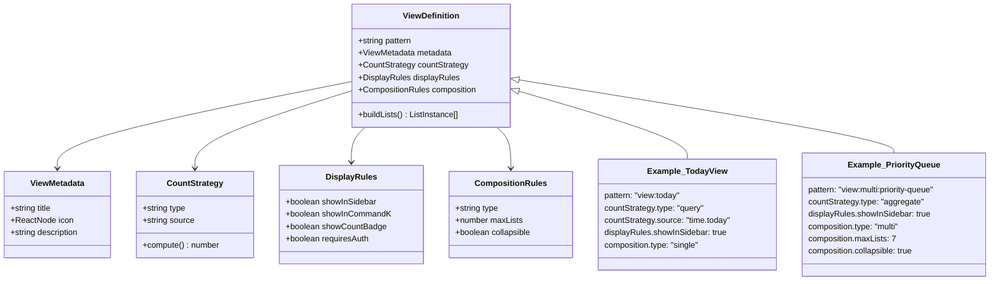

# View Architecture - Visual Diagrams

This document contains visual diagrams to supplement the main architecture analysis.

---

## 1. Current Architecture Overview

---

## 2. View Hierarchy & Resolution

---

## 3. Current Count Computation Flow (Problem)

---

## 4. Count Inconsistency Example

---

## 5. Multi-List View Problem

---

## 6. Proposed Solution: Count Registry

---

## 7. Proposed Count Flow (Solution)

---

## 8. Multi-List Count Resolution (Solution)

---

## 9. View Plugin System Architecture

---

## 10. Enhanced View Definition Structure

---

## 11. Data Flow: User Click to Render

---

## 12. Current vs Proposed Performance

---

## 13. Rendering Location Architecture

---

## 14. Command-K Integration

---

## 15. Future: External Integration Architecture

---

**End of Diagrams**
